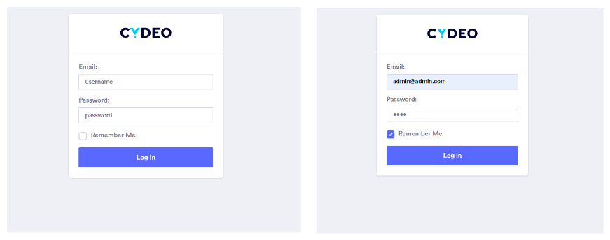
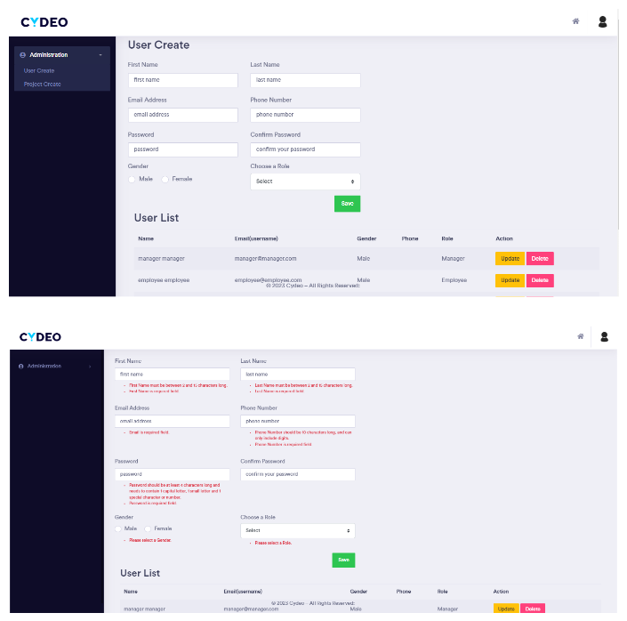
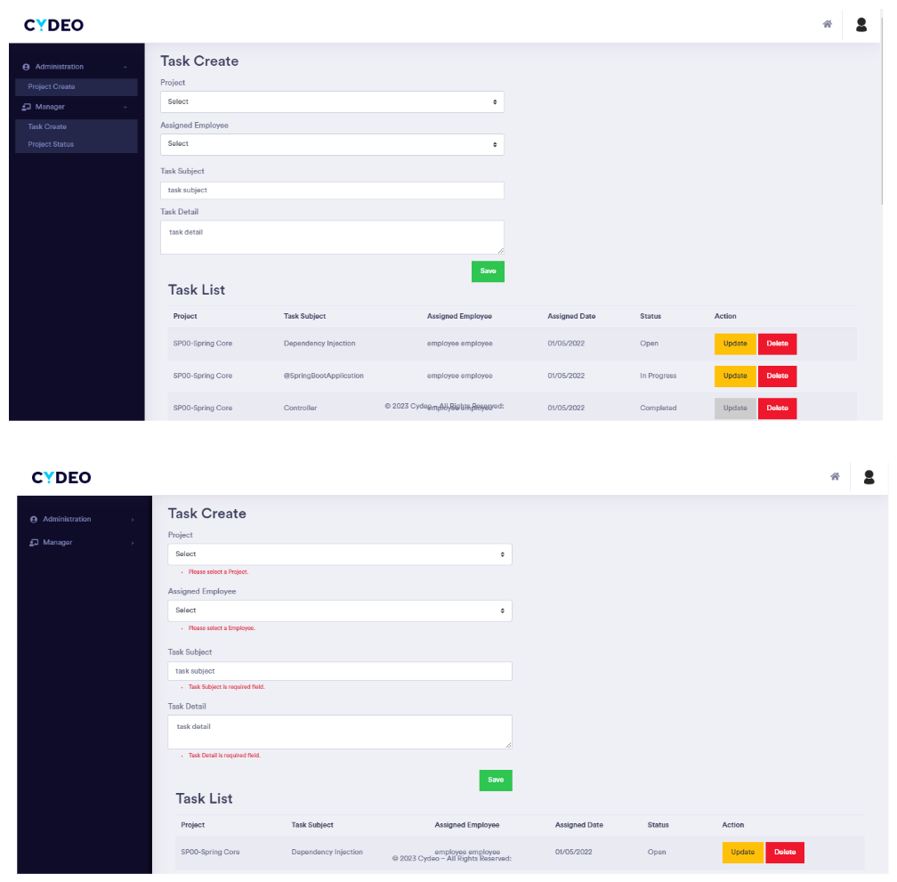
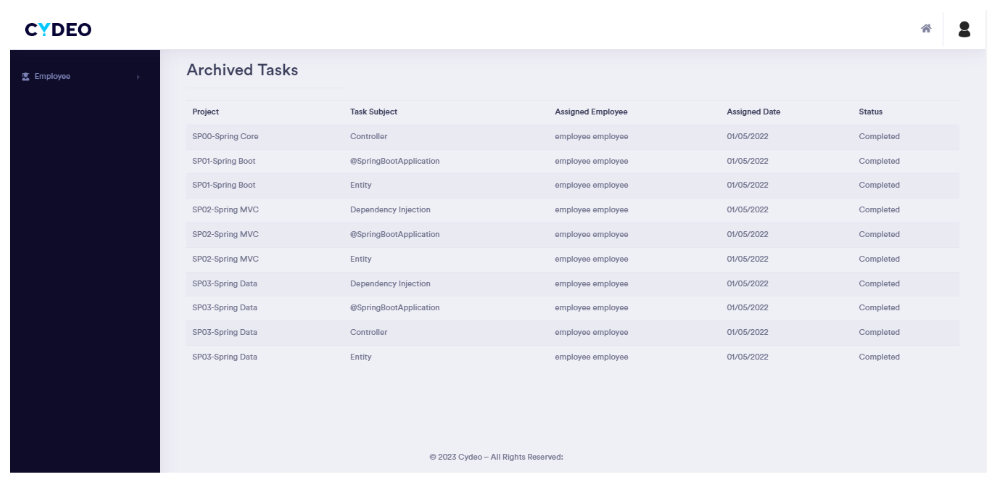

# Project Management Tool - Ticketing Project

### 📖 Information

<ul style="list-style-type:disc">
  <li>This app serves as a versatile
project management solution. At its core, the ticketing app is a powerful project management tool with
three distinct roles: <b>admin, manager, and employee</b>. Each role has specific
privileges and responsibilities.</li> 
  <li>Here is the explanation of roles:
       <ul><b>Admin:</b> Have the authority to create users,
serving as the backbone of the app's administrative functions.</ul> <ul><b>Manager:</b> Can create and view their projects and assign tasks to
employees. Their role is essential for overseeing projects and task
delegation.</ul> <ul><b>Employee:</b>  Focus on executing tasks assigned by managers,
contributing to project execution and success.</ul>
  </li>
</ul>

### 📖 Technical Information
<ul style="list-style-type:disc">
<li><b>Build Automation:</b> Maven is used for build automation, streamlining project management and dependency resolution.</li>
<li><b>Backend Framework:</b> Spring Framework serves as the backbone, using Spring MVC for web development, Spring Data for data access, and Hibernate JPA for seamless object-relational mapping.</li>
<li><b>Security:</b> Spring Security is implemented to manage authentication and authorization.</li>
<li><b>Database Management:</b> PostgreSQL is the chosen relational database management system.</li>
<li><b>User Interface:</b> <ul>Thymeleaf is employed as the template engine, facilitating server-side rendering of dynamic views.</ul>
<ul>Bootstrap is utilized for front-end development, enhancing the user interface with a responsive and modern design.</ul></li>
</ul>

### Technologies

---
- Java 11
- Spring Boot 2.7.5
- Modal View Controller (MVC)
- Spring data, JPA & Hibernate,
- PostgreSQL
- Spring Security
- Maven
- Docker

---

### Business Logics

<ul style="list-style-type:disc">

<li><B>Unique Constraints:</B>
<ul>Made usernames and project codes unique in the system. This prevents duplication and ensures reliable identification.</ul>
</li>

<li><B>Manager Deletion Restriction:</B>
<ul>Managers cannot be deleted if they are assigned to a project. This precaution prevents data loss by keeping managerial associations with ongoing projects.</ul>
</li>

<li><B>Employee Deletion Restriction:</B>
<ul>Cannot delete employees with assigned tasks. This is to keep task data and avoid losing information by mistake.</ul>
</li>

<li><B>Manager Project Completion Authorization:</B>
<ul>Managers can mark a project as completed only if all tasks for the project are also marked as completed. This ensures that projects are considered complete only when all related tasks are successfully finished, keeping a full view of project status.</ul>
</li>

<li><B>Admin Project Completion Authorization:</B>
<ul>When an admin user marks a project as completed, all tasks associated with that project are also marked as completed. This keeps everything consistent and shows how projects and tasks are connected.</ul>
</li>
</ul>

---
# Login Page


# Admin Console


# Manager Console
  

# Employee Console
 


---
### Prerequisites


- Maven or Docker
---


### Docker Run

The application can be built and run by the `Docker` engine.

Please follow directions shown below in order to build and run the application with Docker Compose file;

```
$ cd My-ticketing-project-security
$ docker-compose up -d
```

If you change anything in the project and run it on Docker, you can also use this command shown below

```sh
$ cd My-ticketing-project-security
$ docker-compose up --build
```

---
### Maven Run
To build and run the application with `Maven`, please follow the directions shown below;

```sh
$ cd My-ticketing-project-security
$ mvn clean install
$ mvn spring-boot:run
```


### Creator

- [Muhammed Ihsan SOLAK](https://github.com/muhammedihsansolak)